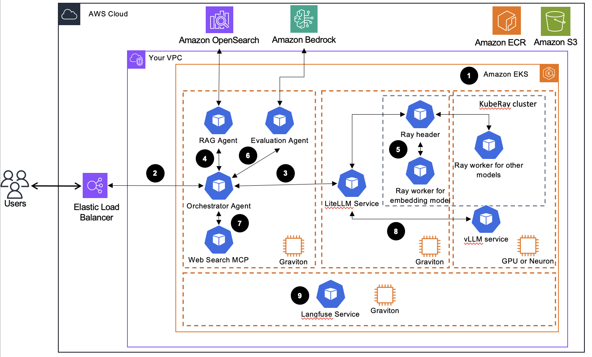

# Cost Effective and Scalable Model Inference and Agentic AI on AWS Graviton with EKS

## Overview
This solution implements a comprehensive, scalable ML inference architecture using Amazon EKS, leveraging both Graviton processors for cost-effective CPU-based inference and GPU instances for accelerated inference. The system provides a complete end-to-end platform for deploying large language models with agentic AI capabilities, including RAG (Retrieval Augmented Generation) and intelligent document processing.

## Architecture


The architecture diagram illustrates our scalable ML inference solution with the following components:

1. **Amazon EKS Cluster**: The foundation of our architecture, providing a managed Kubernetes environment with automated provisioning and configuration.
   
2. **Karpenter Auto-scaling**: Dynamically provisions and scales compute resources based on workload demands across multiple node pools.
   
3. **Node Pools**:
   - **Graviton-based nodes (ARM64)**: Cost-effective CPU inference using m8g/c8g instances
   - **GPU-based nodes (x86_64)**: High-performance inference using NVIDIA GPU instances (g5, g6 families)
   - **x86-based nodes**: General purpose compute for compatibility requirements
   
4. **Model Hosting Services**:
   - **Ray Serve**: Distributed model serving with automatic scaling
   - **Standalone Services**: Direct model deployment for specific use cases
   - **Multi-modal Support**: Text, vision, and reasoning model capabilities
   
5. **Model Gateway**: 
   - **LiteLLM Proxy**: Unified OpenAI-compatible API gateway with load balancing and routing
   - **Ingress Controller**: External access management with SSL termination
   
6. **Agentic AI Applications**:
   - **RAG with OpenSearch**: Intelligent document retrieval and question answering
   - **Intelligent Document Processing (IDP)**: Automated document analysis and extraction
   - **Multi-Agent Systems**: Coordinated AI workflows with specialized agents
   
7. **Observability & Monitoring**: 
   - **Langfuse**: LLM observability and performance tracking
   - **Prometheus & Grafana**: Infrastructure monitoring and alerting

This architecture provides flexibility to choose between cost-optimized CPU inference on Graviton processors or high-throughput GPU inference based on your specific requirements, all while maintaining elastic scalability through Kubernetes and Karpenter.

## Quick Start Guide

The whole solution is including two parts, Agentic AI platform and Agentic AI application, let us go through the Agentic AI platform firstly 

We provide two approaches to set up the Agentic AI platform:

### Option 1: Automated Setup with Makefile (Recommended)

For the fastest and most reliable setup, use our automated Makefile:

#### Prerequisites
- EKS cluster set up following the [AWS Solutions Guidance: Automated Provisioning of Application-Ready Amazon EKS Clusters](https://aws.amazon.com/solutions/guidance/automated-provisioning-of-application-ready-amazon-eks-clusters/)
- `kubectl` configured to access your cluster
- Required CLI tools installed (`pnpm`, `pip`, etc.)

#### Complete Installation
```bash
# Install all core components (base infrastructure, models, gateway, observability)
make install
```

#### Individual Components
```bash
# Install specific components as needed
make setup-base           # Base infrastructure
make setup-models         # Model hosting services
make setup-observability  # Langfuse monitoring
make setup-gateway        # LiteLLM proxy gateway
```

#### Utility Commands
```bash
make help                 # Show all available targets
make status               # Check deployment status
make verify-cluster       # Verify EKS cluster access
make clean                # Remove all deployments
```

### Option 2: Manual Step-by-Step Setup

If you prefer manual control or need to customize the installation:

#### Step 1: Set Up EKS Cluster

Set up your EKS cluster using the AWS Solutions Guidance for automated provisioning:

**Follow the [AWS Solutions Guidance: Automated Provisioning of Application-Ready Amazon EKS Clusters](https://aws.amazon.com/solutions/guidance/automated-provisioning-of-application-ready-amazon-eks-clusters/)**

This guidance provides:
- Automated EKS cluster provisioning with best practices
- Pre-configured add-ons and operators
- Security and networking configurations
- Monitoring and observability setup

After completing the guidance, ensure your `kubectl` is configured to access the cluster:

```bash
# Verify cluster access
kubectl cluster-info
kubectl get nodes
```

#### Step 2: Install Base Infrastructure Components

Navigate to the base setup directory and run the installation script:

```bash
cd base_eks_setup
chmod +x install_operators.sh
./install_operators.sh
```

This script installs:
- KubeRay Operator for distributed model serving
- NVIDIA GPU Operator for GPU workloads
- GP3 storage class for optimized storage
- All Karpenter node pools for different workload types

#### Step 3: Deploy Model Hosting Services

Set up the model hosting infrastructure:

```bash
cd model-hosting
chmod +x setup.sh
./setup.sh
```

This deploys:
- Ray service with LlamaCPP and embedding capabilities
- Standalone vLLM reasoning service
- Standalone vLLM vision service
- All necessary Kubernetes resources and configurations

#### Step 4: Set Up Observability

Deploy monitoring and observability tools:

```bash
cd model-observability
chmod +x setup.sh
./setup.sh
```

This installs:
- Langfuse for LLM observability
- Web ingress for external access
- Service monitoring and logging

**Important**: After deployment, configure Langfuse:
1. Access Langfuse web interface
2. Create an organization named "test"
3. Create a project inside it named "demo"
4. Go to "Tracing" menu and set up tracing
5. Record the Public Key (PK) and Secret Key (SK) - you'll need these for the agentic applications


#### Step 5: Deploy Model Gateway

Set up the unified API gateway:

```bash
cd model-gateway
chmod +x setup.sh
./setup.sh
```

This deploys:
- LiteLLM proxy deployment
- Load balancer and ingress configuration
- Waits for services to be ready before proceeding

**Important**: After deployment, configure LiteLLM:
1. Access the LiteLLM web interface
2. Login with username "admin" and password "sk-123456"
3. Go to "Virtual Keys" on the sidebar and create a new key
4. Mark "All Team Models" for the models field
5. Store the generated secret key - you'll need it for the agentic applications

Right now, let us go through the deployment of an Agentic RAG application based on the Agentic AI platform

### Deploy Agentic Applications

#### Multi-Agent RAG with Strands SDK and OpenSearch

This project implements a sophisticated multi-agent Large Language Model (LLM) system using the **Strands SDK** that combines Model Context Protocol (MCP) for tool usage and Retrieval Augmented Generation (RAG) for enhanced context awareness, using OpenSearch as the vector database.

The system is built with a modular multi-agent architecture using Strands SDK patterns with built-in OpenTelemetry tracing:

```
SupervisorAgent (Orchestrator) [with built-in tracing]
├── KnowledgeAgent → Manages knowledge base and embeddings [traced]
├── MCPAgent → Manages tool interactions via MCP protocol [traced]
└── Strands SDK → Provides agent framework, tool integration, and OpenTelemetry tracing
```

#### 🚀 Key Features

##### Multi-Agent Orchestration
- **SupervisorAgent**: Main orchestrator with integrated RAG capabilities using Strands SDK
- **KnowledgeAgent**: Monitors and manages knowledge base changes
- **MCPAgent**: Executes tasks using MCP tools and file operations
- **Built-in Tracing**: All agents include OpenTelemetry tracing via Strands SDK

##### Advanced RAG Capabilities
- **OpenSearch Integration**: Vector storage and similarity search
- **Embedding Generation**: Configurable embedding models and endpoints
- **Multi-format Support**: Handles markdown, text, JSON, and CSV files
- **Intelligent Search**: Vector similarity search with metadata and scoring
- **Relevance Scoring**: Automatic relevance assessment for search results

##### External Web Search Integration 🌐
- **Tavily API Integration**: Real-time web search via MCP server
- **Automatic Triggering**: Web search activated when RAG relevance < 0.3
- **News Search**: Dedicated recent news and current events search
- **Hybrid Responses**: Combines knowledge base and web search results
- **Smart Fallback**: Graceful degradation when web search unavailable

##### MCP Tool Integration
- **Filesystem Operations**: Read, write, and manage files using Strands tools
- **Web Search Tools**: Tavily-powered web and news search capabilities
- **Extensible Architecture**: Easy to add new MCP servers
- **Error Handling**: Robust tool execution with fallbacks
- **Built-in Tools**: Integration with Strands built-in tools

##### Observability & Tracing
- **OpenTelemetry Integration**: Native tracing through Strands SDK
- **Multiple Export Options**: Console, OTLP endpoints, Jaeger, Langfuse
- **Automatic Instrumentation**: All agent interactions are automatically traced
- **Performance Monitoring**: Track execution times, token usage, and tool calls

#### 🏃‍♂️ Usage

##### Option 1: Container Deployment on Kubernetes(Recommended)

For production deployments, use the containerized solution with Kubernetes:

###### Prerequisites

- Python 3.9+
- EKS cluster
- TAVILY_API_KEY(https://docs.tavily.com/documentation/quickstart#get-your-free-tavily-api-key)
- AWS credentials configured

###### Installation

**1. Build and Push Container Images**

```bash
# Navigate to the strandsdk agentic app directory
cd agentic-apps/strandsdk_agentic_rag_opensearch

# Build Docker images and push to ECR
./build-images.sh

# This script will:
# - Create ECR repositories if they don't exist
# - Build main application and MCP server images
# - Push images to ECR
# - Update Kubernetes deployment files with ECR image URLs
```

**2. Deploy OpenSearch Cluster**

```bash
# Deploy OpenSearch with CloudFormation and EKS Pod Identity
./deploy-opensearch.sh [stack-name] [region] [namespace]

# Example:
./deploy-opensearch.sh strandsdk-rag-opensearch-stack us-east-1 default

# This script will:
# - Deploy OpenSearch cluster via CloudFormation
# - Set up EKS Pod Identity for secure access
# - Create the vector index automatically
# - Configure IAM roles and policies
```

**3. Configure Kubernetes Secrets and ConfigMap**

Update the ConfigMap with your actual service endpoints and configuration:

```bash
# Apply the ConfigMap and Secrets
kubectl apply -f k8s/configmap.yaml
# Edit the ConfigMap with your actual values
kubectl edit configmap app-config

# Key values to update:
# - LITELLM_BASE_URL: Your LiteLLM service endpoint
# - EMBEDDING_BASE_URL: Your embedding service endpoint  
# - OPENSEARCH_ENDPOINT: From OpenSearch deployment output
# - LANGFUSE_HOST: Your Langfuse instance (optional)
```

Update secrets with your API keys:

```bash
# Update secrets with base64 encoded values
kubectl edit secret app-secrets

# To encode your keys:
echo -n "your-api-key" | base64

# Keys to update:
# - litellm-api-key: Your LiteLLM API key
# - embedding-api-key: Your embedding service API key
# - tavily-api-key: Your Tavily API key for web search
# - langfuse-public-key: Langfuse public key (optional)
# - langfuse-secret-key: Langfuse secret key (optional)
```

**4. Deploy Kubernetes Applications**

```bash
# Apply the service account (if not already created)
kubectl apply -f k8s/service-account.yaml

# Deploy the MCP server first
kubectl apply -f k8s/tavily-mcp-deployment.yaml

# Deploy the main application
kubectl apply -f k8s/main-app-deployment.yaml

# Check deployment status
kubectl get pods -l app=tavily-mcp-server
kubectl get pods -l app=strandsdk-rag-app

# Check services and ingress
kubectl get svc
kubectl get ingress
```

**5. Test the Deployed System**

```bash
# Get the Application Load Balancer endpoint
ALB_ENDPOINT=$(kubectl get ingress strandsdk-rag-ingress-alb -o jsonpath='{.status.loadBalancer.ingress[0].hostname}')

# Test the health endpoint
curl -X GET "http://${ALB_ENDPOINT}/health"

# Test a simple query
curl -X POST "http://${ALB_ENDPOINT}/query" \
  -H "Content-Type: application/json" \
  -d '{
    "query": "What is Bell'\''s palsy?",
    "include_web_search": true
  }'

# Test knowledge embedding
curl -X POST "http://${ALB_ENDPOINT}/embed-knowledge" \
  -H "Content-Type: application/json"

# Test with a more complex medical query
curl -X POST "http://${ALB_ENDPOINT}/query" \
  -H "Content-Type: application/json" \
  -d '{
    "question": "Find information about \"What was the purpose of the study on encainide and flecainide in patients with supraventricular arrhythmias\". Summarize this information and create a comprehensive story.Save the story and important information to a file named \"test1.md\" in the output directory as a beautiful markdown file.",
    "top_k": 3
  }' \
  --max-time 600
```

##### Option 2: Local Development

###### Prerequisites

- Python 3.9+
- EKS cluster
- TAVILY_API_KEY
- Public facing Opensearch cluster
- AWS credentials configured

###### Installation

```bash
# Navigate to the strandsdk agentic app directory
cd agentic-apps/strandsdk_agentic_rag_opensearch

# Create virtual environment
python3 -m venv venv
source venv/bin/activate  # On Windows: venv\Scripts\activate

# Install dependencies
pip install -r requirements.txt

# Set up environment variables
cp .env.example .env
# Edit .env with your configuration
```

###### Configuration

Create a `.env` file with the following variables:

```env
# OpenAI Configuration
OPENAI_API_KEY=your-openai-api-key
OPENAI_BASE_URL=https://api.openai.com/v1
DEFAULT_MODEL=us.anthropic.claude-3-7-sonnet-20250219-v1:0

# AWS Configuration  
AWS_REGION=us-east-1
OPENSEARCH_ENDPOINT=https://your-opensearch-domain.region.es.amazonaws.com

# Tavily Web Search Configuration
TAVILY_API_KEY=your-tavily-api-key

# Tracing Configuration (Optional)
OTEL_EXPORTER_OTLP_ENDPOINT=http://localhost:4318
OTEL_EXPORTER_OTLP_HEADERS=key1=value1,key2=value2
STRANDS_OTEL_ENABLE_CONSOLE_EXPORT=true

# Optional: Langfuse for observability
LANGFUSE_HOST=https://cloud.langfuse.com
LANGFUSE_PUBLIC_KEY=your-public-key
LANGFUSE_SECRET_KEY=your-secret-key

# Application Settings
KNOWLEDGE_DIR=knowledge
OUTPUT_DIR=output
VECTOR_INDEX_NAME=knowledge-embeddings
TOP_K_RESULTS=5
```

###### Deploy

**1. Start Tavily MCP Server (for Web Search)**

```bash
# Start the Tavily web search server
python scripts/start_tavily_server.py

# Or run directly
python src/mcp_servers/tavily_search_server.py
```

**2. Embed Knowledge Documents**

```bash
# Process and embed all knowledge documents
python -c "from src.agents.knowledge_agent import knowledge_agent; print(knowledge_agent('Please embed all knowledge files'))"
```

**3. Run the Multi-Agent System**

```bash
# Standard mode (with built-in tracing)
source venv/bin/activate
python -m src.main

# Clean mode (async warnings suppressed)
python run_main_clean.py

# Single query - standard mode
python -c "from src.main import run_single_query; print(run_single_query('What is Bell\'s palsy?'))"

# Single query - clean mode
python run_single_query_clean.py "What is Bell's palsy?"

# Single query - ultra clean mode (completely suppressed stderr)
python run_completely_clean.py "What is Bell's palsy?"
```

**4. Test the System**

```bash
# Run comprehensive tests including web search integration
python -m src.test_agents

# Test the enhanced RAG system with chunk relevance evaluation
python test_enhanced_rag.py

# Test web search integration specifically
python src/test_web_search_integration.py

# Run tests with clean output (async warnings filtered)
python run_clean_test.py
```

**Note**: The enhanced system uses RAGAs for chunk relevance evaluation, which may generate harmless async cleanup warnings. Use `run_clean_test.py` for a cleaner testing experience.


##### Container Features

- **Auto-scaling**: Kubernetes HPA for dynamic scaling
- **Health Checks**: Built-in health endpoints for monitoring
- **Service Discovery**: Internal service communication via Kubernetes DNS
- **Security**: EKS Pod Identity for secure AWS service access
- **Observability**: OpenTelemetry tracing with multiple export options
- **Load Balancing**: ALB for external traffic distribution
- **Configuration Management**: ConfigMaps and Secrets for environment-specific settings

#### 🔍 Observability & Tracing

The system includes comprehensive observability through Strands SDK's built-in OpenTelemetry integration:

##### Automatic Tracing
- **All agents** are automatically traced using Strands SDK
- **Tool calls**, **LLM interactions**, and **workflows** are captured
- **Performance metrics** including token usage and execution times

##### Trace Export Options
- **Console Output**: Set `STRANDS_OTEL_ENABLE_CONSOLE_EXPORT=true` for development
- **OTLP Endpoint**: Configure `OTEL_EXPORTER_OTLP_ENDPOINT` for production
- **Langfuse**: Use Langfuse credentials for advanced observability
- **Jaeger/Zipkin**: Compatible with standard OpenTelemetry collectors

##### Local Development Setup
```bash
# Pull and run Jaeger all-in-one container
docker run -d --name jaeger \
  -e COLLECTOR_OTLP_ENABLED=true \
  -p 16686:16686 \
  -p 4317:4317 \
  -p 4318:4318 \
  jaegertracing/all-in-one:latest

# Access Jaeger UI at http://localhost:16686
```

#### 🧠 Agent Workflows

##### Knowledge Management Workflow
1. **File Monitoring**: Scans knowledge directory for changes
2. **Change Detection**: Uses file hashes and timestamps
3. **Document Processing**: Handles multiple file formats
4. **Embedding Generation**: Creates vector embeddings
5. **Vector Storage**: Stores in OpenSearch with metadata

##### RAG Retrieval Workflow  
1. **Query Processing**: Analyzes user queries
2. **Embedding Generation**: Converts queries to vectors
3. **Similarity Search**: Finds relevant documents in OpenSearch
4. **Context Formatting**: Structures results for LLM consumption
5. **Relevance Ranking**: Orders results by similarity scores

##### MCP Tool Execution Workflow
1. **Tool Discovery**: Connects to available MCP servers
2. **Context Integration**: Combines RAG context with user queries
3. **Tool Selection**: Chooses appropriate tools for tasks
4. **Execution Management**: Handles tool calls and responses
5. **Result Processing**: Formats and returns final outputs

#### 🔧 Extending the System

##### Adding New Agents

```python
from strands import Agent, tool
from src.utils.strands_langfuse_integration import create_traced_agent

# Define tools for the agent
@tool
def my_custom_tool(param: str) -> str:
    """Custom tool implementation."""
    return f"Processed: {param}"

# Create the agent with built-in tracing
my_agent = create_traced_agent(
    Agent,
    model="us.anthropic.claude-3-7-sonnet-20250219-v1:0",
    tools=[my_custom_tool],
    system_prompt="Your specialized prompt here",
    session_id="my-agent-session",
    user_id="system"
)
```

##### Adding New MCP Servers

```python
from fastmcp import FastMCP

mcp = FastMCP("My Custom Server")

@mcp.tool(description="Custom tool description")
def my_custom_tool(param: str) -> str:
    """Custom tool implementation."""
    return f"Processed: {param}"

if __name__ == "__main__":
    mcp.run(transport="streamable-http", port=8002)
```

#### 📊 Monitoring and Observability

The system includes comprehensive observability features:

- **OpenTelemetry Integration**: Native tracing through Strands SDK
- **Multiple Export Options**: Console, OTLP endpoints, Jaeger, Langfuse
- **Workflow Summaries**: Detailed execution reports
- **Performance Metrics**: Duration and success tracking
- **Error Handling**: Comprehensive error reporting and recovery

#### 🧪 Example Use Cases

##### Medical Knowledge Query
```python
query = "What are the symptoms and treatment options for Bell's palsy?"
result = supervisor_agent(query)
print(result['response'])
```

##### Document Analysis and Report Generation
```python
query = "Analyze the medical documents and create a summary report saved to a file"
result = supervisor_agent(query)
# System will retrieve relevant docs, analyze them, and save results using MCP tools
```

#### 🔍 Architecture Benefits

1. **Modularity**: Each agent has specific responsibilities
2. **Scalability**: Agents can be scaled independently  
3. **Reliability**: Isolated failures don't affect the entire system
4. **Extensibility**: Easy to add new capabilities
5. **Observability**: Comprehensive monitoring and tracing via Strands SDK
6. **Standards Compliance**: Uses MCP for tool integration and OpenTelemetry for tracing

#### 🔧 Key Improvements

##### Unified Architecture
- **Single Codebase**: No separate "enhanced" versions - all functionality is built into the standard agents
- **Built-in Tracing**: OpenTelemetry tracing is automatically enabled through Strands SDK
- **Simplified Deployment**: One main application with all features included
- **Consistent API**: All agents use the same tracing and configuration patterns

##### Enhanced Developer Experience
- **Automatic Instrumentation**: No manual trace management required
- **Multiple Export Options**: Console, OTLP, Jaeger, Langfuse support out of the box
- **Environment-based Configuration**: Easy setup through environment variables
- **Clean Code Structure**: Removed duplicate wrapper functions and complex manual tracing
- **Async Warning Management**: Clean test runner filters harmless async cleanup warnings
- **Robust Error Handling**: Fallback mechanisms ensure system reliability

