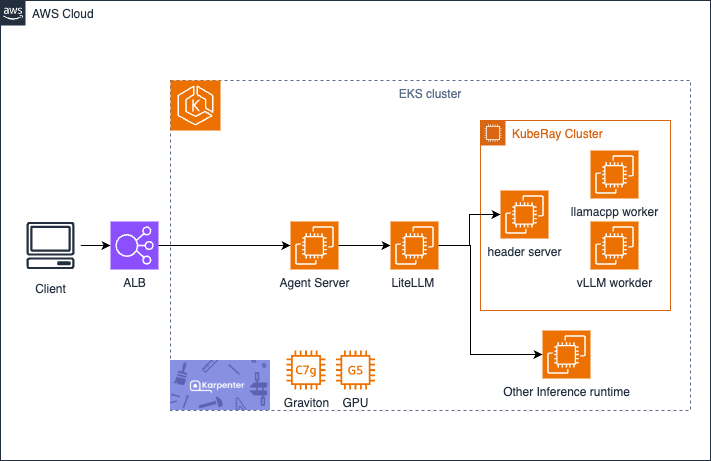

# Cost effective and Scalable Model Inference and Agentic AI on AWS Graviton with Ray on EKS

## Overview
The solution implements a scalable ML inference architecture using Amazon EKS, leveraging both Graviton processors for CPU-based inference and GPU instances for accelerated inference. The system utilizes Ray Serve for model serving, deployed as containerized workloads within a Kubernetes environment.

## Architecture


The architecture diagram illustrates our scalable ML inference solution with the following components:

1. **Amazon EKS Cluster**: The foundation of our architecture, providing a managed Kubernetes environment.
   
2. **Karpenter Auto-scaling**: Dynamically provisions and scales compute resources based on workload demands.
   
3. **Node Pools**:
   - **Graviton-based nodes (ARM64)**: Cost-effective CPU inference using m8g/c8g instances
   - **GPU-based nodes (x86_64)**: High-performance inference using NVIDIA GPU instances (g5, g6 families)
   
4. **Ray Serve Deployment**:
   - **Ray Head**: Manages the Ray cluster and coordinates workload distribution
   - **Ray Workers**: Execute the inference tasks with either llama.cpp (on Graviton) or vLLM (on GPU)
   
5. **LiteLLM Proxy**: Acts as a unified inference API gateway, providing standardized OpenAI-compatible endpoints and handling request routing, load balancing, and fallback mechanisms across multiple model backends.
   
6. **Function Calling Service**: Enables agentic AI capabilities by allowing models to interact with external APIs and services.
   
7. **Monitoring & Observability**: Prometheus and Grafana for performance monitoring and visualization.

This architecture provides flexibility to choose between cost-optimized CPU inference on Graviton processors or high-throughput GPU inference based on your specific requirements, all while maintaining elastic scalability through Kubernetes and Karpenter.

For networking-intensive workloads such as agent orchestration and API proxying, we deploy these components on Graviton instances to leverage their excellent price-performance ratio for concurrent connection handling. Graviton processors excel at handling high-throughput networking tasks, making them ideal for the LiteLLM proxy and agent services that manage numerous concurrent requests and API calls. This approach optimizes cost efficiency while maintaining responsive performance for these connection-oriented workloads.

## Prerequisites

### 1. EKS cluster with KubeRay Operator installed

You can set up the EKS cluster and install the KubeRay Operator using the provided script in the `base_eks_setup` directory:

```bash
cd base_eks_setup
./provision-v2.sh
```

This script performs the following operations:
- Creates an EKS cluster (version 1.31) with 2 initial nodes
- Installs required EKS add-ons (vpc-cni, coredns, eks-pod-identity-agent)
- Installs cert-manager
- Sets up Karpenter for auto-scaling
- Installs the KubeRay Operator
- Configures Prometheus and Grafana for monitoring

You can modify the following variables in the script to customize your deployment:
- `REGION`: AWS region (default: us-east-1)
- `CLUSTER_NAME`: EKS cluster name (default: llm-eks-cluster)

### 2. Karpenter node pool setup for both Graviton and x86 based GPU instances

The `karpenter-pools` directory contains YAML files for configuring Karpenter node pools:

- **karpenter-cpu-inference-Graviton.yaml**: Configures a node pool for Graviton-based CPU inference
  - Uses ARM64 architecture (Graviton)
  - Targets m7g/c7g instance types (4xlarge)
  - Configured for on-demand instances
  - Includes appropriate taints and labels for workload targeting

- **karpenter-cpu-inference-Graviton-Spot.yaml**: Similar to above but configured for spot instances

- **karpenter-cpu-agent-Graviton.yaml**: Configures a node pool for agent workloads on Graviton

- **Karpenter-gpu-inference-x86.yaml**: Configures a node pool for GPU-based inference
  - Uses x86_64 architecture
  - Targets NVIDIA GPU instances (g5, g6 families)
  - Configured with appropriate EBS storage and system resources

To apply these configurations after the EKS cluster is set up:

```bash
kubectl apply -f karpenter-pools/karpenter-cpu-inference-Graviton.yaml
kubectl apply -f karpenter-pools/Karpenter-gpu-inference-x86.yaml
kubectl apply -f karpenter-pools/Karpenter-agent-Graviton.yaml
```

### 3. Make sure to run all commands from the appropriate directory

## Deployment Options

### Option 1: CPU-based Inference with llama.cpp on Graviton

Deploy an elastic Ray service hosting llama 3.2 model on Graviton:

#### 1. Edit your Hugging Face token for env `HUGGING_FACE_HUB_TOKEN` in the secret section of `ray-service-llamacpp-with-function-calling.yaml`

#### 2. Configure model and inference parameters in the yaml file:
   - `MODEL_ID`: Hugging Face model repository
   - `MODEL_FILENAME`: Model file name in the Hugging Face repo
   - `N_THREADS`: Number of threads for inference (recommended: match host EC2 instance vCPU count)
   - `CMAKE_ARGS`: C/C++ compile flags for llama.cpp on Graviton

> Note: The example model uses GGUF format, optimized for llama.cpp. See [GGUF documentation](https://huggingface.co/docs/hub/en/gguf) for details. You can find out different quantization version for the model, check these hugging face repo: https://huggingface.co/bartowski or https://huggingface.co/unsloth  
> Note: To run function call, better with reasoning model like Qwen-QwQ-32B in this example


#### 3. Create the Kubernetes service:
```bash
kubectl create -f ray-service-llamacpp-with-function-calling.yaml
```

#### 4. Get the Kubernetes service name:
```bash
kubectl get svc
```

### Option 2: GPU-based Inference with vLLM

Deploy an elastic Ray service hosting models on GPU instances using vLLM:

#### 1. Edit your Hugging Face token for env `HUGGING_FACE_HUB_TOKEN` in the secret section of `ray-service-vllm-with-function-calling.yaml`

#### 2. Configure model and inference parameters in the yaml file:
   - `MODEL_ID`: Hugging Face model repository (default: mistralai/Mistral-7B-Instruct-v0.2)
   - `GPU_MEMORY_UTILIZATION`: Percentage of GPU memory to utilize (default: 0.9)
   - `MAX_MODEL_LEN`: Maximum sequence length for the model (default: 8192)
   - `MAX_NUM_SEQ`: Maximum number of sequences to process in parallel (default: 4)
   - `MAX_NUM_BATCHED_TOKENS`: Maximum number of tokens in a batch (default: 32768)
   - `ENABLE_FUNCTION_CALLING`: Set to "true" to enable function calling support

#### 3. Create the Kubernetes service:
```bash
kubectl create namespace rayserve-vllm
kubectl create -f ray-service-vllm-with-function-calling.yaml
```

#### 4. Get the Kubernetes service name:
```bash
kubectl get svc -n rayserve-vllm
```

## Agentic AI with Function Calling

This solution supports building agentic AI applications that can leverage either CPU-based (llama.cpp) or GPU-based (vLLM) model inference backends. The agent architecture enables models to call external functions and services.

### Understanding Agentic AI and Function Calling

Agentic AI refers to AI systems that can act autonomously to achieve specific goals by making decisions and taking actions. In this solution, we implement agentic capabilities through function calling, which allows language models to:

1. **Recognize when to use tools**: The model identifies when external data or capabilities are needed to fulfill a user request
2. **Structure function calls**: The model generates properly formatted function calls with appropriate parameters
3. **Process function results**: The model incorporates returned data into its responses

Function calling enables models to bridge the gap between natural language understanding and external systems, allowing them to:

- Access real-time information (like weather data in our example)
- Perform calculations or data transformations
- Interact with external APIs and services
- Execute specific actions based on user requests

Our implementation provides a framework where the model:
- Parses user intent from natural language
- Determines which function to call and with what parameters
- Makes the API call through a dedicated service
- Processes the returned information to generate a coherent response

This approach significantly extends the capabilities of language models beyond their pre-trained knowledge, making them more useful for real-world applications.

### Deploying the Function Service

#### 1. Configure the function service:
The function service is defined in `agent/kubernetes/combined.yaml` and includes:
- A Kubernetes Secret for API credentials
- A Deployment for the function service (weather service example)
- A LoadBalancer Service to expose the function API

#### 2. Deploy the function service:
```bash
kubectl apply -f agent/kubernetes/combined.yaml
```

#### 3. Configure your model backend for function calling:
- For CPU-based inference: Use `ray-service-llamacpp-with-function-calling.yaml`
- For GPU-based inference: Use `ray-service-vllm-with-function-calling.yaml` with `ENABLE_FUNCTION_CALLING: "true"`

#### 4. Test function calling:
Once deployed, you can test the weather function service using a simple curl command:

```bash
curl -X POST http://<YOUR-LOAD-BALANCER-URL>/chat \
  -H "Content-Type: application/json" \
  -d '{"message": "What is the current weather in London?"}'
```
```bash
curl -X POST http://<YOUR-LOAD-BALANCER-URL>/chat \
  -H "Content-Type: application/json" \
  -d '{"message": "What is the future 2 days weather in London?"}'
```

The service will:
1. Process your natural language query
2. Identify the need to call the weather function
3. Make the appropriate API call
4. Return the weather information in a conversational format

## How do we measure
Our client program will generate prompts with different concurrency for each run. Every run will have common GenAI related prompts and assemble them into standard HTTP requests, and concurrency calls will keep increasing until the maximum CPU usage reaches to nearly 100%. We capture the total time from when a HTTP request is initiated to when a HTTP response is received as the latency metric of model performance. We also capture output token generated per second as throughput. The test aims to reach maximum CPU utilization on the worker pods to assess the concurrency performance.

Follow this guidance if you want to set it up and replicate the experiment

### 1. Launch load generator instance
Launch an EC2 instance as the client in the same AZ with the Ray cluster (For optimal performance testing, deploy a client EC2 instance in the same AZ as your Ray cluster. To generate sufficient load, use a compute-optimized instance like c6i.16xlarge. If you observe that worker node CPU utilization remains flat despite increasing concurrent requests, this indicates your test client may be reaching its capacity limits. In such cases, scale your testing infrastructure by launching additional EC2 instances to generate higher concurrent loads.)

### 2. Execute port forward for the ray service
```bash
kubectl port-forward service/ray-service-llamacpp-serve-svc 8000:8000
```

### 3. Configure environment
Install Golang environment in the client EC2 instance (please refer [this](https://go.dev/doc/install) for the Golang installation guidance). Specify the environment variables as the test configuration.

```bash
export URL=http://localhost:8000/v1/chat/completions
export REQUESTS_PER_PROMPT=<The_number_of_concurrent_calls>
export NUM_WARMUP_REQUESTS=<The_number_of_warmup_requests>
```

### 4. Run test
Run the performance test golang script and you can find the results from the output.

```bash
go run perf_benchmark.go
```

## Contact
Please contact wangaws@ or fmamazon@ if you want to know more and/or contribute.
