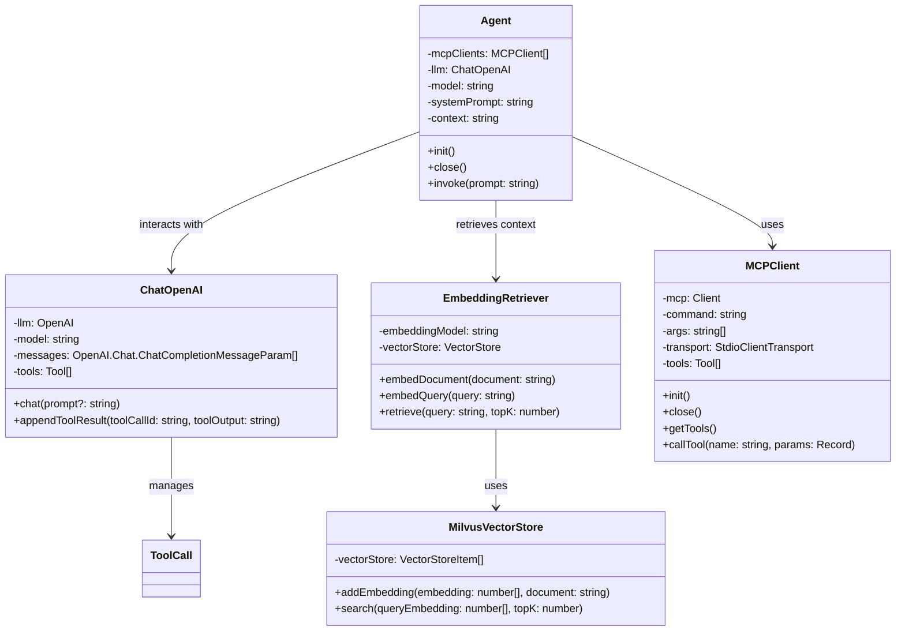

# Augmented LLM with MCP and RAG

This project demonstrates how to build an augmented Large Language Model (LLM) system that combines Model Context Protocol (MCP) for tool usage and Retrieval Augmented Generation (RAG) for enhanced context awareness, all without relying on frameworks like LangChain or LlamaIndex.

## Project Goals

- Create a **framework-independent** augmented LLM system
- Implement **MCP** (Model Context Protocol) for tool usage
- Build a simplified **RAG** (Retrieval Augmented Generation) system
- Demonstrate practical tasks like retrieving information and generating content
- Provide a modular architecture that can be easily extended

## Architecture

The system consists of several modular components that work together:



## How It Works: The Complete Workflow

1. **Knowledge Embedding**
   - The system reads documents from the `knowledge` directory
   - Each document is converted to a vector embedding using AWS Bedrock's Titan embedding model
   - Embeddings and their source documents are stored in Milvus vector database

2. **Context Retrieval (RAG)**
   - When a user query is received, it's also converted to an embedding using AWS Bedrock
   - The system finds the most relevant documents by calculating cosine similarity between embeddings in Milvus
   - The top matching documents are combined to form context for the LLM

3. **MCP Tool Setup**
   - The system initializes MCP clients that connect to tool servers
   - Currently, it uses the filesystem MCP server for file operations
   - Each MCP client registers its available tools with the agent

4. **Agent Initialization**
   - The agent is created with the LLM model, MCP clients, and retrieved context
   - The context is sent to the LLM as part of the initial conversation

5. **Task Execution**
   - The user's task is sent to the LLM along with the context
   - The LLM processes the request and may decide to use tools
   - If tools are needed, the agent routes calls to the appropriate MCP client
   - Tool results are fed back to the LLM to continue the conversation
   - This cycle continues until the LLM completes the task without further tool calls

6. **Output Generation**
   - The LLM generates a final response incorporating tool results and context
   - In the example task, it creates a markdown file with information about "Antonette"

## Example Use Case

The current implementation demonstrates a specific task:
1. The system retrieves information about a user named "Antonette" from the knowledge base
2. It summarizes this information and creates a story about her
3. Using the filesystem MCP tool, it saves the output to a markdown file in the `output` directory

## Key Components

- **Agent**: Coordinates the overall workflow and manages tool usage
- **ChatOpenAI**: Handles interactions with the language model and tool calling
- **MCPClient**: Connects to MCP servers and manages tool calls
- **EmbeddingRetriever**: Creates and searches vector embeddings for relevant context
- **VectorStore**: Interfaces with Milvus for storing and retrieving embeddings

## Technologies Used

- **AWS Bedrock**: For generating high-quality text embeddings using the Titan embedding model
- **Milvus**: Scalable vector database for efficient similarity search and retrieval
- **OpenAI API**: For language model capabilities
- **MCP Protocol**: For standardized tool usage
- **Vector Embeddings**: For semantic search and retrieval
- **TypeScript**: For type-safe implementation

## AWS Bedrock Integration

The system leverages AWS Bedrock for generating embeddings:

- **Titan Embedding Model**: Provides high-quality semantic embeddings for documents and queries
- **AWS SDK Integration**: Seamless connection to AWS services
- **Scalable Processing**: Can handle large volumes of document embedding requests
- **Cost-Effective**: Pay-as-you-go pricing model for embedding generation

## Milvus Vector Database

Milvus serves as the vector database for storing and retrieving embeddings:

- **High Performance**: Optimized for similarity search operations
- **Scalability**: Can handle millions of vectors with low latency
- **Flexible Indexing**: Supports multiple indexing types for different use cases
- **Cloud-Native**: Designed for containerized environments
- **Advanced Search**: Supports ANN (Approximate Nearest Neighbor) search algorithms

## Benefits of This Approach

- **Framework Independence**: Built without relying on frameworks like LangChain or LlamaIndex
- **Modular Design**: Components are separated for easy maintenance and extension
- **Flexibility**: Can be adapted to use different LLMs, embedding models, or tools
- **Transparency**: Clear workflow makes it easy to understand and debug
- **Scalability**: Architecture can be extended to handle more complex use cases
- **Production-Ready**: Uses enterprise-grade components like AWS Bedrock and Milvus

## Getting Started

```bash
# Clone the repository
git clone <repository-url>

# Install dependencies
pnpm install

# Set up environment variables
# Create a .env file with:
# - OPENAI_API_KEY
# - OPENAI_BASE_URL (optional)
# - AWS_REGION
# - AWS credentials for Bedrock
# - MILVUS_ADDRESS


# Run the application
pnpm dev
```

## Extending the System

This modular architecture can be extended in several ways:
- Add more MCP servers for additional tool capabilities
- Implement advanced Milvus features like filtering and hybrid search
- Add more sophisticated RAG techniques like reranking or chunking
- Implement conversation history for multi-turn interactions
- Deploy as a service with API endpoints
- Integrate with different LLM providers
- Scale the vector database for production workloads
- Implement caching strategies for frequently accessed embeddings
